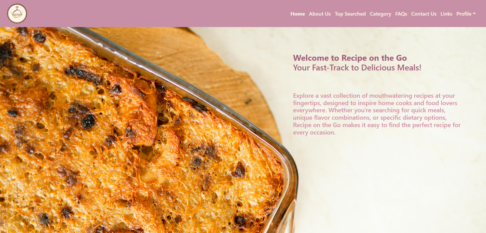
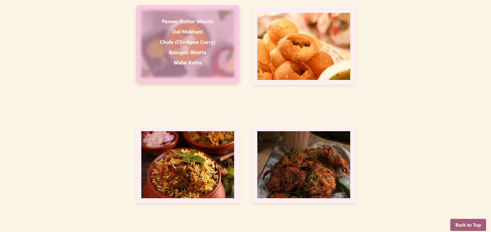
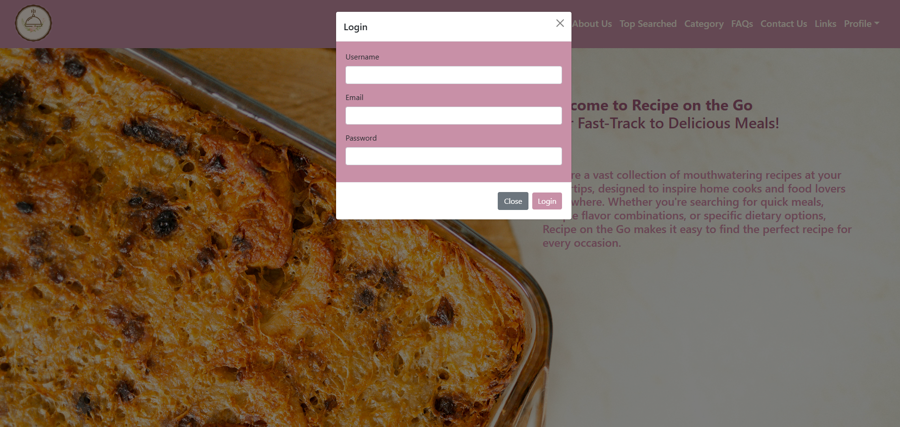

# 🍲 Recipe on the Go

**Recipe on the Go** is a responsive and user-friendly recipe web application that allows users to discover, explore, and manage a wide variety of recipes. From comfort foods to trendy bites, the platform offers categorized recipes, a top-searched carousel, and a clean modern UI with built-in login/register functionality.

---

## 🚀 Features

- 🧑‍🍳 **Explore Recipes** – Browse recipes by categories like Street Food, Curries, Snacks, and more.
- 🔍 **Top-Searched Carousel** – Highlights popular and trending recipes with image previews.
- 👥 **User Authentication** – Register, log in, and manage your profile via modal-based forms.
- 📱 **Responsive Design** – Works smoothly on desktop.
- 💬 **FAQs & Contact** – Built-in sections for help and support.
- 🎨 **Modern UI** – Clean layout with smooth scrolling, Bootstrap components, and custom styling.

---

## 📸 Screenshots

### 🏠 Home Page  

### 🔍 Categories 

### 🔐 Login/Register Modal  

## 🛠️ Tech Stack

- **HTML5**, **CSS3**
- **JavaScript**
- **Bootstrap 5**
- **Font Awesome** for icons

---

